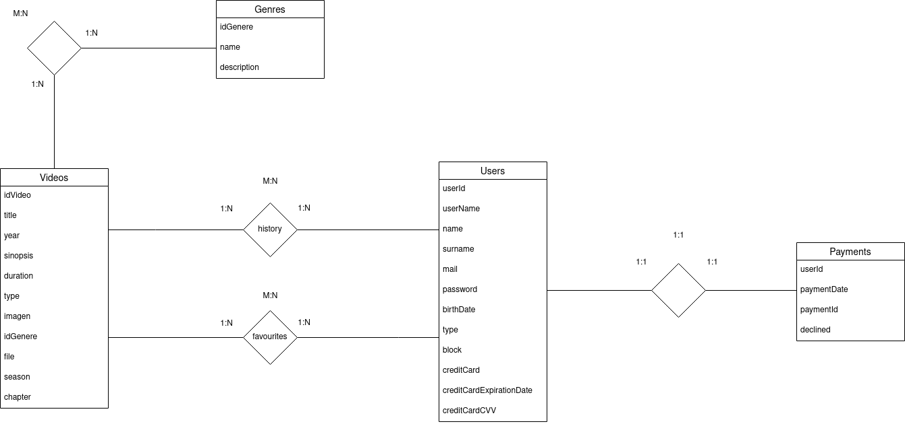

# STREAMINGAJI

 __Jordi, Ignasi y Adán__

Proyecto de 2º de __Desarrollo de Aplicaciones Web__ de la Escola del Treball de Barcelona. El proyecto consiste en desarrollar una aplicación web tipo _Netflix_ de visualización de streaming online y se ha realizado para la asignatura de Desarrollo Web en entorno Servidor.

## Diagrama de la BBDD

## Mockups de las diferentes páginas que realizaremos

## Rutas API 

# Listado de todas las series:
Get:/series

# Listado de vídeo por id
Get:/video/{id}

# Listado de todos los usuarios
Get:/users

# Listado de todos los videos:
Get:/videos

# Listado de todas las movies:
Get:/movies

# Listado de todos los generos
Get:/genres

# Ruta para recibir bearer token

Parametros tienen que ser email y password, como params.

Get:/login

# Crea un video
Post:/videos

# Modifica video
Patch:/videos

Parametros de video: 'title','year','sinopsis','duration','type','image','file','trailer','season','chapter'

# Listado de usuario por id
/user/{id}
# Crear usuario
Post:/user

Parametros de usuario: 'name','userName','surname','email', 'password'

# Modifica un usuario
Post:/user/{id}

Parametros de usuario: 'name','userName','surname','email', 'password'

